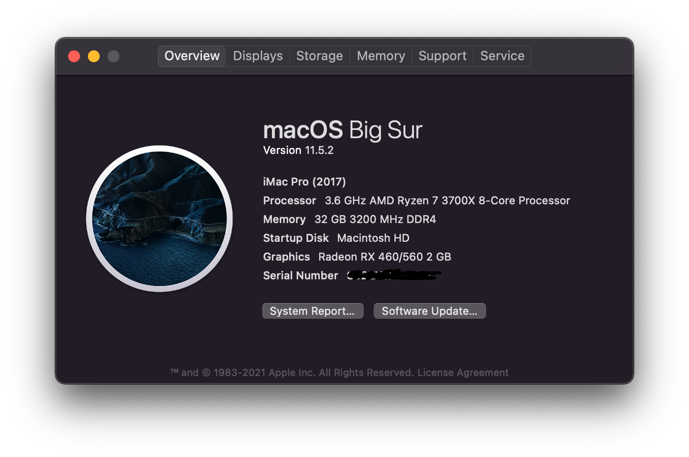

# Opencore EFI for Hackintosh Big Sur

| Hardware | Name |
|----------|------|
| CPU | AMD Ryzen 7 3700X |
| Motherboard | MSI B550 Mortar MAG |
| Display Card | MSI RX460 2GB |
| Wireless Adapter | Fenvi FV-T919 |
| OS Storage Drive | Western Digital SN850 |
| RAM | Corsair Vengeance RGB PRO SL 32GB (2x16GB) |

# Usage
Follow [Create the USB](https://dortania.github.io/OpenCore-Install-Guide/installer-guide/) from Opencore guide and in the gathering file section
just drop `EFI-secure-boot` into your `EFI` folder in `EFI` drive.
> for `secure-boot` please follow Opencore Secure Boot setup

### ATTENTION
then **you need to generate SMBIOS and replace the value into config.plist file** please follow [PlatformInfo Setup](https://dortania.github.io/OpenCore-Install-Guide/AMD/zen.html#platforminfo)

# Supported
- Gigabit Ethernet port
- USB 2.0, USB 3.0, USB C
- Bluetooth with Airplay supported, Airpod supported
- WIFI
- Message, Appstore, iCloud (Need internal en0 card setup)
- Handoff, Universal clipboard are worked with some setup (see [How I got Sidecar working on my Hackintosh](https://www.reddit.com/r/hackintosh/comments/ierd1d/how_i_got_sidecar_handoffcontinuity_working_on_my/))

# Unsupported
- Sidecar display black screen
- All Apple Virtual Machine software is not working 😔
    - Docker ( only Docker machine with Virtualbox works )
    - Parallels Desktop
    - VM Fusion
